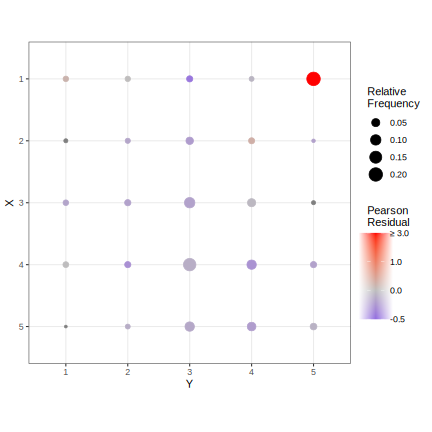

# robord: Robust Ordinal Data Analysis

## Example of robust estimation of polychoric correlation coefficient

### Generate simulated data

```R
library("robord")

## 5 answer categories each, define latent thresholds as follows
Kx <- Ky <- 5
thresX <- c(-Inf, -1.5, -1, -0.25, 0.75, Inf)
thresY <- c(-Inf, -1.5, -1, 0.5, 1.5, Inf)
rho_true <- 0.3 # true polychoric correlation

## simulate rating data
set.seed(20240111)
latent <- mvtnorm::rmvnorm(1000, c(0, 0), matrix(c(1, rho_true, rho_true, 1), 2, 2))
xi <- latent[,1]
eta <- latent[,2]
x <- as.integer(cut(xi, thresX))
y <- as.integer(cut(eta, thresY))
```

### Compare MLE and robust estimator without contamination

```R
## MLE
mle <- polycor_mle(x = x, y = y)
mle$thetahat 
# > mle$thetahat
#       rho         a1         a2         a3         a4         b1         b2         b3         b4 
# 0.3151109 -1.4868862 -0.9829336 -0.2318141  0.7887485 -1.5112743 -0.9889993  0.4276572  1.4582239 

## robust
polycor <- polycor(x = x, y = y, c = 1.5)
polycor$thetahat
# > polycor$thetahat
#       rho         a1         a2         a3         a4         b1         b2         b3         b4 
# 0.3151414 -1.4868373 -0.9829001 -0.2316910  0.7888495 -1.5112325 -0.9889749  0.4277239  1.4582497
```

Thus, in the absence of contamination, both estimators yield equivalent solutions. Next, we introduce 20% contamination.

### Compare MLE and robust estimator with contamination

```R
## replace 20% of observations with negative leverage points
x[1:200] <- 1
y[1:200] <- Ky

## MLE
mle <- polycor_mle(x = x, y = y)
mle$thetahat 
# > mle$thetahat
#         rho          a1          a2          a3          a4          b1          b2          b3          b4 
# -0.34675954 -0.63244517 -0.39741400  0.10278048  0.93030935 -1.57214524 -1.12479616  0.03080319  0.63796166 

## robust
polycor <- polycor(x = x, y = y, c = 1.5)
polycor$thetahat
# > polycor$thetahat
#       rho         a1         a2         a3         a4         b1         b2         b3         b4 
# 0.3180104 -1.4461457 -0.9605778 -0.2342293  0.7795890 -1.5299883 -0.9981569  0.4092214  1.4566111 

```

We see that 20% contamination leads to a substantial bias in the MLE, whereas the robust estimator is still accurate.
The package also provides methods for printing and plotting:

```R
## print and plot method
polycor
# > polycor
# 
# Polychoric Correlation
#        Estimate Std.Err.
# rho       0.318  0.03857
# 
# X-thresholds
#     Estimate Std.Err.
# a1   -1.4460  0.06619
# a2   -0.9606  0.05262
# a3   -0.2342  0.04449
# a4    0.7796  0.04961
# 
# Y-thresholds
#     Estimate Std.Err.
# b1   -1.5300  0.06931
# b2   -0.9982  0.05309
# b3    0.4092  0.04538
# b4    1.4570  0.06759

plot(polycor)
```



Indeed, the Pearson residual of contaminated cell `(x,y) = (1,5)` is excessively large compared to the others, which are all around the value 1.

We can also do a test on a each cell being outlying, that is, a Pearson residual of larger than 1 (one-sided alternative). Here are its p-values (adjusted for multiple comparisons via the Benjamini-Hochberg procedure):

```R
> celltest(polycor)$pval_adjusted
   y
x           1         2         3         4         5
  1 0.9999975 0.9999975 0.9999975 0.9999975 0.0000000
  2 0.9999975 0.9999975 0.9999975 0.9999975 0.9999975
  3 0.9999975 0.9999975 0.9999975 0.9999975 0.9999975
  4 0.9999975 0.9999975 0.9999975 0.9999975 0.9999975
  5 0.9999975 0.9999975 0.9999975 0.9999975 0.9999975
```

Hence, at the recommended extremely conservative significance level of 0.001, only the cell  `(x,y) = (1,5)` is correctly identified as outlying.


## Authors
Max Welz (welz@ese.eur.nl)
